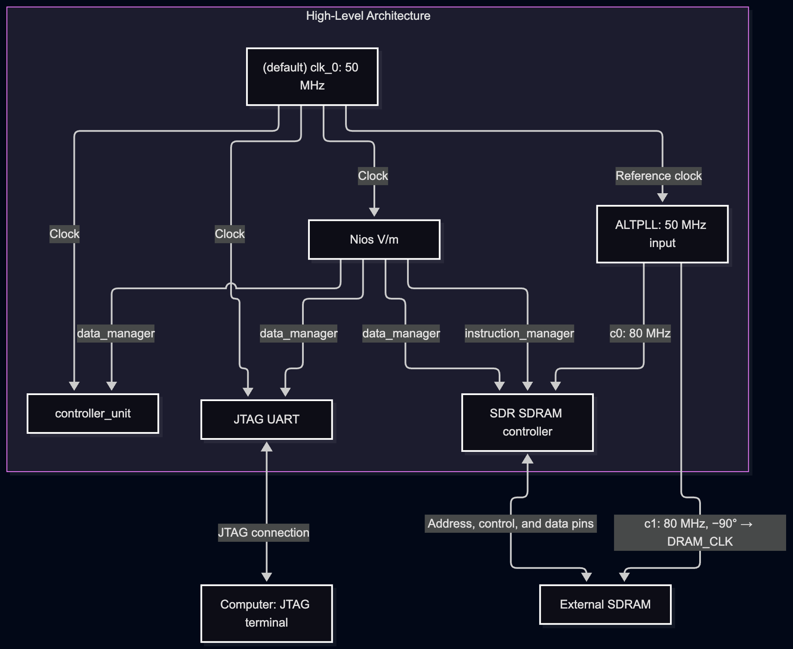
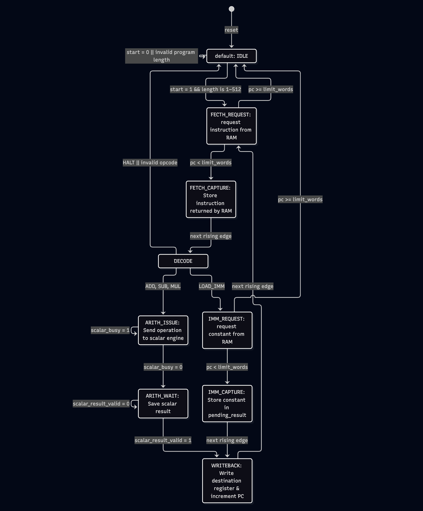
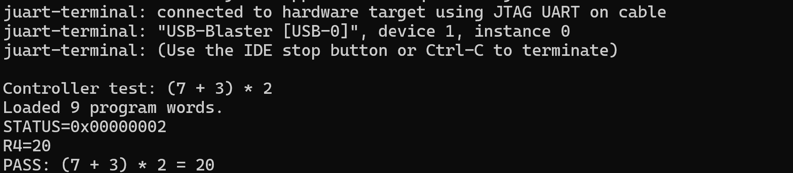
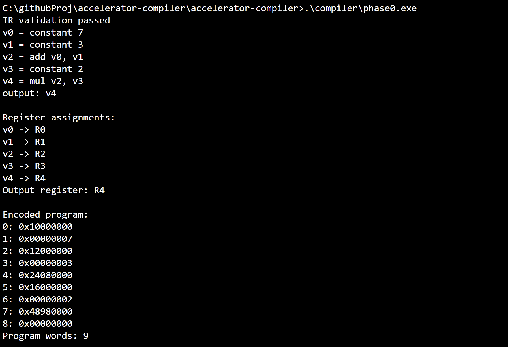

# accelerator-compiler
---

#### This is an ongoing project

I'm building a small FPGA-based accelerator and a compiler backend that maps computations to custom hardware. Through this project, I want to understand how AI accelerators work and how compilers map operations and data to their compute units and memory.

I'm developing it incrementally, starting with the processor-accelerator interface and scalar arithmetic, then adding tensor operations and compiler support as the project progresses.

### Hardware Architecture
---


#### High Level Architecture
At a high level, the Nios V/m CPU controls the system and runs its software from external SDRAM through the SDRAM controller. The JTAG UART provides console communication with the computer.

The accelerator’s top-level module, `controller_unit`, connects the CPU interface to three modules: `instruction_ram`, `execution_controller`, and `scalar_unit`. The accelerator has its own instruction memory, separate from the external SDRAM used by Nios. This memory stores up to 512 32-bit words containing instructions and immediate values.

Nios loads an accelerator program into instruction RAM, sets its length, and starts execution through the following word addresses:

| Word address | Write | Read |
| :--- | :--- | :--- |
| 0 | Start when `writedata[0] = 1` | 0 |
| 1 | Ignored | Status: `busy` (bit 0), `done` (bit 1), `error` (bit 2) |
| 2 | Program length, including immediate words | Program length |
| 8–15 | Ignored | Registers R0–R7 |
| 512–1023 | Instruction RAM words 0–511 | 0 |

These addresses are relative to the controller unit; their CPU byte offsets are the word addresses multiplied by four. Program writes, length changes, and additional start requests are ignored while execution is busy.

After launch, `execution_controller` sequences the program independently. It maintains a program counter and eight 32-bit registers, R0–R7, and fetches instructions from instruction RAM. Each instruction has the following layout:

| Bits | Field | Purpose |
| :--- | :--- | :--- |
| 31–28 | Opcode | Selects the instruction |
| 27–25 | Destination register | Register receiving the result |
| 24–22 | Source A register | First arithmetic operand |
| 21–19 | Source B register | Second arithmetic operand |
| 18–0 | Unused | Ignored by the hardware |

The execution controller decodes the opcode in bits 31–28:

| Opcode | Instruction | Action |
| :--- | :--- | :--- |
| `0000` | HALT | Stop execution and set `done` |
| `0001` | LOAD_IMM | Load the next RAM word into the destination register |
| `0010` | ADD | Add the two source registers |
| `0011` | SUB | Subtract source B from source A |
| `0100` | MUL | Multiply the two source registers |

For `LOAD_IMM`, the next RAM word is treated as a full 32-bit value, so the instruction consumes two words. For arithmetic instructions, the execution controller reads the source registers and translates the opcode into the scalar unit’s 2-bit operation code: `00` for addition, `01` for subtraction, or `10` for multiplication.

The `scalar_unit` captures the operands and operation code and passes them to `scalar_arith_unit`, which performs the calculation. The scalar unit returns the result with a completion signal, and the execution controller writes it into the destination register before fetching the next instruction.

Nios polls the execution status while the accelerator runs. Execution stops when the controller encounters `HALT` or detects an error, such as an unsupported opcode or a fetch beyond the program length. Nios can then read the final values from R0–R7. The `done` and `error` flags remain set until reset or the next accepted start request.

The diagram below shows the execution controller’s states and the transitions between them.


For more detailed diagrams, go to this folder: .\doc\images\diagram

### Compiler Backend — In Progress
---

The compiler backend is being developed in C++, with operations constructed directly in a small IR, without a parser. Each operation defines a logical value, and the program identifies which value to return as its output.

The current implementation includes:

- **IR validation:** Checks for duplicate definitions, undefined operands and outputs, self-references, and unsupported operations.
- **Basic register allocation:** Assigns a separate hardware register to each result in operation order. Programs requiring more than eight registers are rejected; register reuse and spilling are not yet supported.
- **Instruction encoding:** Converts constants into `LOAD_IMM` instructions followed by their values, encodes arithmetic operations, and appends `HALT`. The encoder enforces the instruction RAM’s 512-word limit.

IR validation and register allocation have been checked locally with a small example computing `(7 + 3) × 2`, assigning its output to R4. Instruction encoding has been added, but local execution and FPGA integration are still pending.

Next, I’ll verify the encoded output, add a C++ reference executor and repeatable tests, and export generated programs for execution on the FPGA. Board results will then be compared against the reference executor.

### Demo Output
---
<b>Hardware Demo Output running C program on Nios V/m</b>



<b>Compiler Demo output</b>



The video below shows the DE10-lite board running the current design, along with a simple LED animation.

https://github.com/user-attachments/assets/8b566521-1c05-4bad-a8dc-58d336d68ac6

### Codebase Directory
---

```
accelerator-compiler
├── fpga/
│   ├── accel/
│       ├── accel/              # generated Platform Designer system files
│       ├── rtl/                # custom hardware modules
│       ├── software/hal_app    # C application running on Nios V
|       └── tb/                 # RTL testbenches
│   └── doc/                    # diagrams, images, & documentation
├── .gitignore
├── LICENSE
└── README.md
```

### Build and Run
---

The steps below outline how to build the current design and run the C application on the DE10-Lite board

| File | Purpose |
| :--- | :---: |
| **accel.qpf** | Quartus project file |
| **accel.qsf** | project settings, device selection, & pin assignment |
| **fpga_top.sdc** | timing constraints |
| **accel.qsys** | Platform Designer system definition |

Software used:
* Quartus Prime Lite 25.1
* Platform Designer
* Quartus Programmer
* Nios V Command Shell & niosv-bsp-editor
* Ashling RiscFree IDE
* juart-terminal (for viewing console output)
* Questa for RTL simulation (requires a separate free license)

Build & program the hardware:
* Open accel.qpf in Quartus Prime
* Open accel.qsys in Platform Designer and generate HDL
* Make sure fpga_top.v is included in the project and fpga_top is set as the top-level module
* Run Full Compilation
* Open Quartus Programmer and program the board using the generated .sof file

Build & run the software
* Launch niosv-bsp-editor from the Nios V Command Shell and generate the BSP
* Import the Nios V application project into Ashling
* Build and run hal_app on the board
* Open juart-terminal to view the output