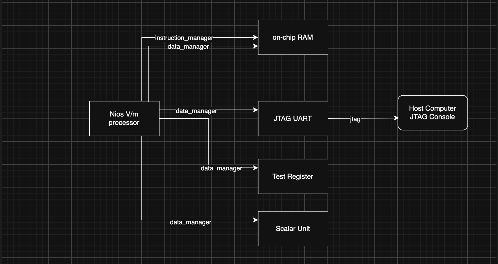
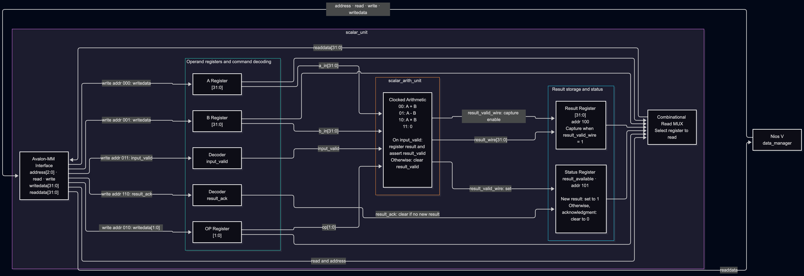
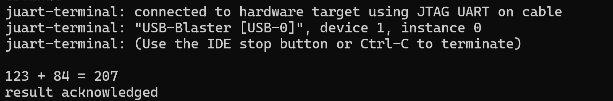
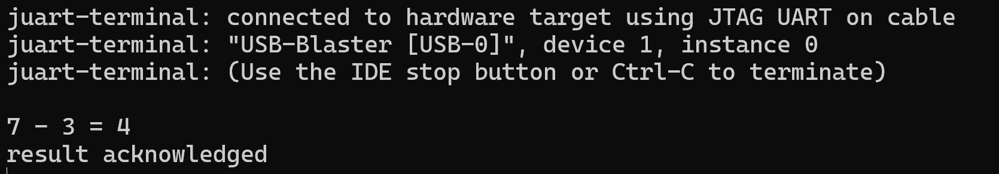
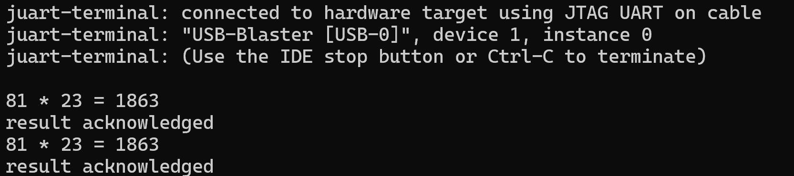

# accelerator-compiler
---

#### This is an ongoing project

My goal here is to build a small FPGA-based accelerator and a compiler backend that maps computations to the custom hardware. The goal is to learn how AI accelerators work and how a compiler connects computations to the hardware's compute unit and memory.
I'm building it incrementally, starting with the processor-accelerator interface and scalar arithmetic, then adding tensor operations and compiler support as the project develops.

### Current Architecture

#### High Level Architecture
On a high-level, the Nios V CPU controls the system, fetching instructions and accessing data in on-chip RAM. It communicates with the host computer's JTAG console through the JTAG UART. A custom test register was used to verify the initial system connections, while the scalar unit supports addition, subtraction, and multiplication.

#### Scalar Unit Architecture
The scalar unit wraps an arithmetic unit with registers that the CPU can read and write. Its interfaces takes a 3-bit address, read and write signals, and 32-bit write data, and returns 32-bit read data.

The CPU first writes the two operands and an operation code into their registers. It then writes to the start address, which asserts input_valid and tells the arithmetic unit to compute using the stored inputs.

When the arithmetic unit produces a result, it asserts result_valid. The scalar unit captures the result in the result register and sets the status flag, result_available. The CPU can check this flag, read the result, and then write to the acknoledgment address. This asserts result_ack, clearing the status flag while leaving the stored result unchanged.

The table below shows what each address does when read or written
| Address | write | read |
| :--- | :---: | :---: |
| **000** | A | A |
| **001** | B | B |
| **010** | op | op |
| **011** | input_valid | - |
| **100** | - | result |
| **101** | - | result_valid |
| **110** | result_ack | - |
| **111** | - | - |

To see complete RTL, go to: fpga/doc/quartus-rtl

### Demo Output

The video below shows the DE10-lite board running the current design.

https://github.com/user-attachments/assets/8b566521-1c05-4bad-a8dc-58d336d68ac6

### Codebase Directory

### How to run

Software Used: 
* Quartus Prime Lite 25.1 (I used their full installer which includes all the add-ons)